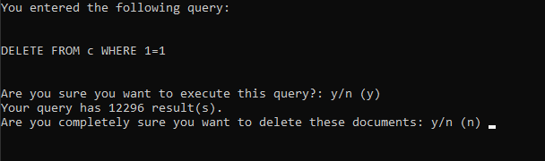

# CosmosDbDeleteQuery
> Use a WHERE clause to delete documents within a Cosmos DB container

## How does it look?


## What can I do with it?
Ever wanted to delete multiple documents, but the Microsoft Azure Storage Explorer won't let you? This tool will help.
It's as easy as writing a SQL query. Actually, you will only need to provide the WHERE clause.

```sql
DELETE FROM c
WHERE .....
```